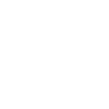

# Telescope (v0.3.0)



An Open-Source Toolkit for Interactive Multimedia Applications.

Documentation: [avialable here](https://telescope.readthedocs.io/en/latest/)<br>
Example: [available here](./test/example.cpp)

---
### Table of Contents
  1. [Dependencies](#dependencies) <br>
  1.1 [SDL2](#dependencies) <br>
  1.2 [Box2D](#dependencies) <br>
  1.3 [glm](#dependencies) <br>
  1.4 [vulkan](#dependencies)<br>
  2. [Installation](#installation)<br>
  3. [Troubleshooting](#troubleshooting)<br>
  5. [License](#license)<br>
  6. [Authors](#authors)
  
---
### Dependencies

The following dependencies need to be met: 
+ `SDL2`, 2.0.18+
+ `SDL2_image`, `SDL2_ttf`, `SDL2_mixer`, `SDL2_net`
+ `Vulkan`, 1.2+
+ `glm`
+ `box2D`, 2.0+


They can be installed on unix-based OS using a package manager, for example, `apt`:

```bash
# build the newest stable SDL2 from source
git clone https://github.com/libsdl-org/SDL
cd SDL
mkdir build
cd build
../configure
make
make install
cd ../..
rm -r SDL

# install other SDL2 components
sudo apt-get install libsdl2-image-dev libdsl2-mixer-dev libsdl2-ttf-dev libsdl2-net-dev

# install vulkan
sudo apt-get install libvulkan-dev

# install box2D
sudo apt-get install libbox2d2 libbox2d-dev

# install glm
sudo apt-get install libglm-dev
```

### Installation

Make sure all dependencies are met. Then, you can install Telescope like so:

```bash
git clone https://github.com/jhigginbotham64/Telescope
cd Telescope
git submodule update --init --recursive
mkdir build
cd build
cmake .. #-DCMAKE_INSTALL_PREFIX=<install location>
make clean
make install # may require sudo depending <install location>
```

Where `-DCMAKE_INSTALL_PREFIX=<install location>` is an optional argument that determines, what directory the Telescope shared library will be installed into.

Then you can make Telescope available to your C++ executable or library from within your own `CMakeLists.txt`:
```cmake
find_library(telescope REQUIRED 
    NAMES telescope
    #PATHS <install location>
)
target_link_libraries(<your_target> PRIVATE telescope)
```

Where 
+ `<your_target>` is the name of your CMake library or executable
+ `<install location>` is the location specified during CMake configuration [earlier](#installation)

To include all of telescopes functionality, simply include this header:
```cpp
#include <telescope.hpp>
```

---
### Troubleshooting

#### `telescope.hpp`: No such file or directory

When compiling your own C / C++ target that uses telescope, the following compiler error may occur:

```bash
/home/.../main.cpp: fatal error: telescope.h: No such file or directory
   11 | #include <telescope.h>
      |          ^~~~~~~~~~~~~
```

This happens if the telescope install directory was not added to your CMake targets include directories. To address this, in your own CMakeLists.txt, add the following lines:

```cmake
find_library(telescope REQUIRED 
    NAMES telescope
    PATHS <install location>
)
target_include_directories(<your_target> PRIVATE <install location>)
target_link_libraries(<your_target> PRIVATE telescope)
```
Where
  + `<your_target>` is the name of your CMake executable or library
  + `<install loaction>` is the directory specified as `CMAKE_INSTALL_PREFIX` during [CMake configuration](#installation)

Now, your compiler should be able to locate `telescope.h` properly.

---

### License

Telescope v0.3.0 is available under MIT License, available [here](https://opensource.org/licenses/MIT).

---

### Authors

Telescope was created and implemented by [Joshua Higginbotham](https://github.com/jhigginbotham64) and [Clemapfel](https://github.com/clemapfel/) .
